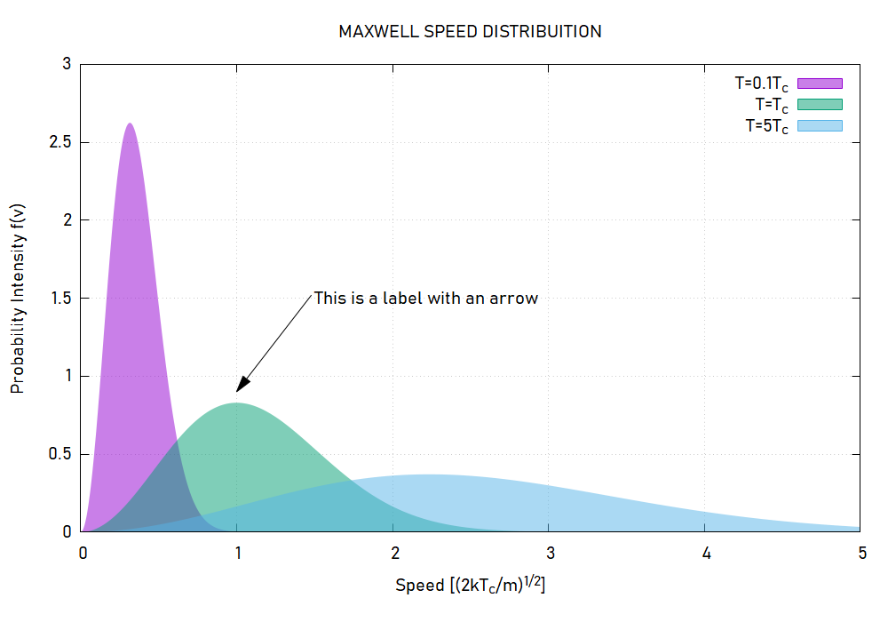
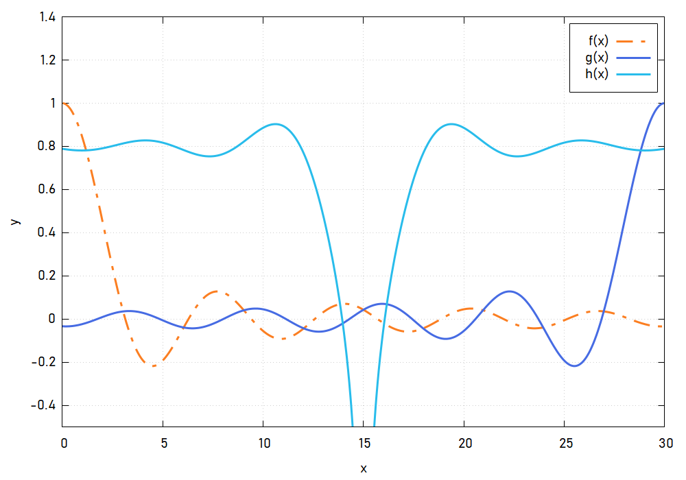
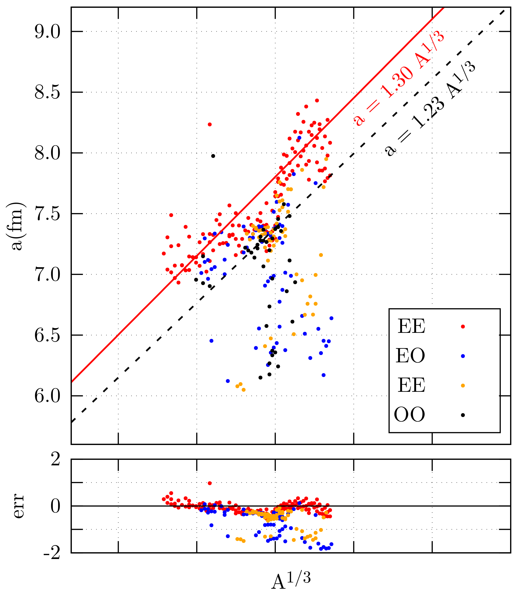

## Gnuplot Templates

Make Clean, Simple and Nice looking plots with Gnuplot!

The examples bellow serve to show how a simple and very clean script can produce very nice looking figures. 

To produce the exact images you find bellow you'll need to install  [Bahnschrift ](https://www.cufonfonts.com/font/bahnschrift) and [LM Roman 10](https://fonts2u.com/lmroman10-regular.font). 

#### Examples 

###### Maxwell Distribution (PNG)

###### Random Functions (PNG)

###### Latex like Plot (PDF)

