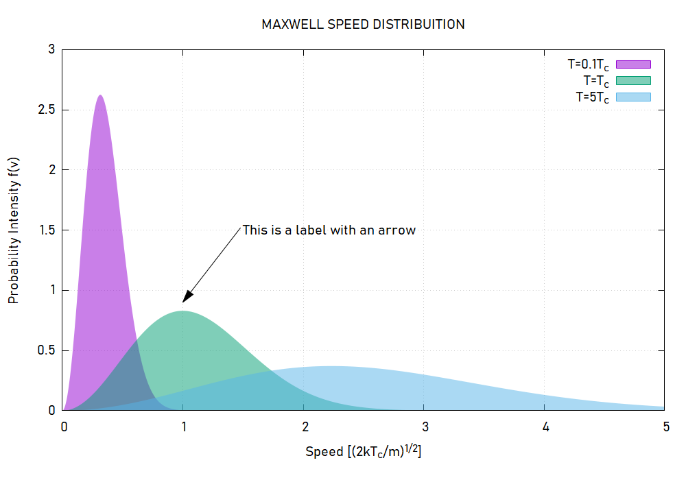
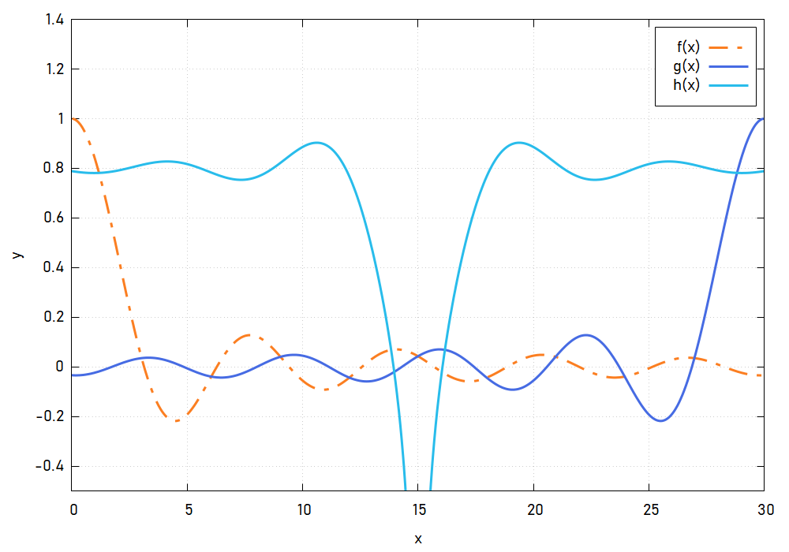

## Gnuplot Templates

Make Clean, Simple and Nice looking plots with Gnuplot!

To produce the exact images you find bellow you'll need to install the [Bahnschrift Font](https://www.cufonfonts.com/font/bahnschrift) and the blah blah font

#### Examples 

###### Maxwell Distribution

###### Random Functions

###### Latex like Plot

